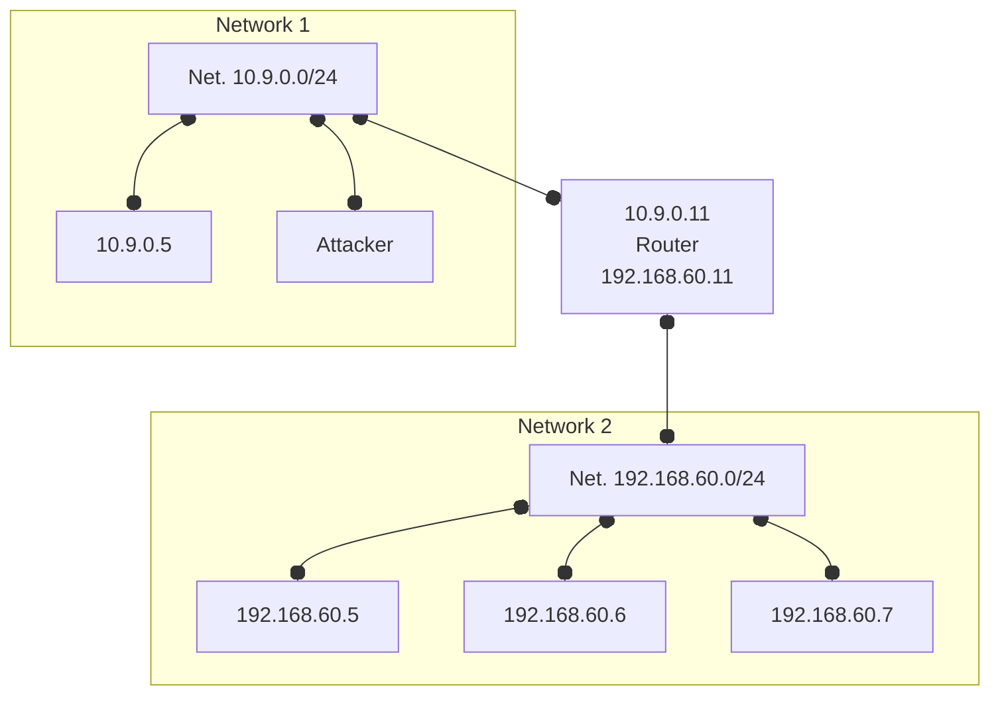

# Firewall
## Environment setup


# Task 1.A
- install needed stuff
  ```bash
  apt install build-essential linux-generic
  ```
- fix the makefile: `find / | grep include/generated/autoconf.h`
- replace `/lib/modules.../` in makefile with the one found
  - in our case: `/usr/src/linux-headers-5.10.0-1026-oem`
- but didn't work...
  - tried also: `make -C /lib/modules/5.4.0-131-generic/build M=$(PWD) clean`
    - but still no luck...
      - (looks like in mac os is not as straightforward as on Linux due to the docker implementation, installing a kernel module directly on mac os is nearly impossible due to system limitations, a viable way might be exploiting the linuxkit vm on top of which docker engine for mac os runs)
- run (finally) make
- module related commands
  | command | desc |
  | --- | --- |
  | `sudo insmod hello.ko`  | inserting a module |
  | `lsmod \| grep hello` | list modules 
  | `sudo rmmod hello` | remove the module
  | `dmesg` | check the messages |

--- 

# Task 1.B
:(