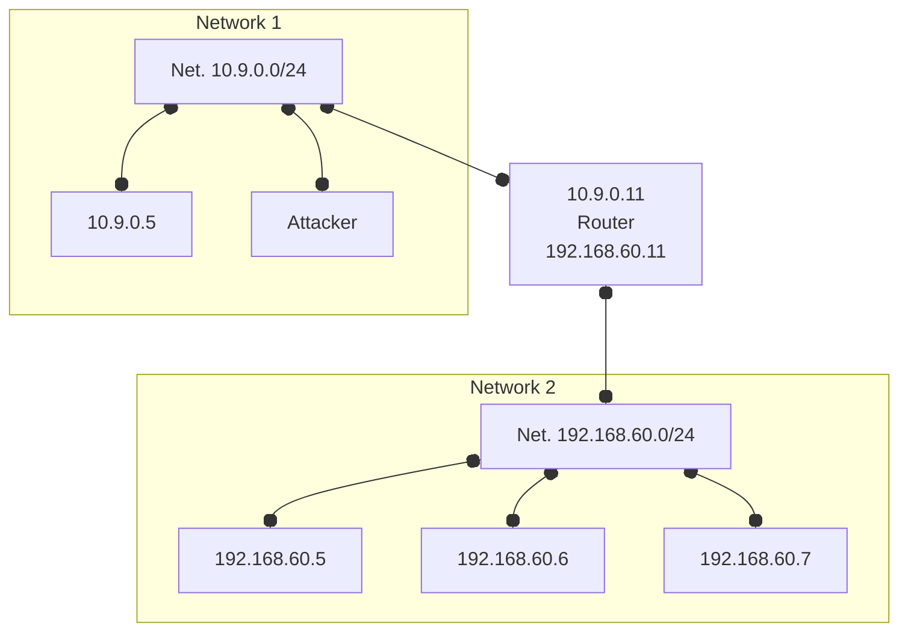

# Firewall
## Environment setup

```mermaid
flowchart TD
  subgraph Network 1
    N["Net. 10.9.0.0/24"]
    N o--o Attacker
    N o--o 5["10.9.0.5"]
  end
  N o--o R["10.9.0.11\nRouter\n192.168.60.11"]
  R o--o N2
  subgraph Network 2
    N2["Net. 192.168.60.0/24"]
    N2 o--o 605["192.168.60.5"]
    N2 o--o 606["192.168.60.6"]
    N2 o--o 607["192.168.60.7"]
  end
```